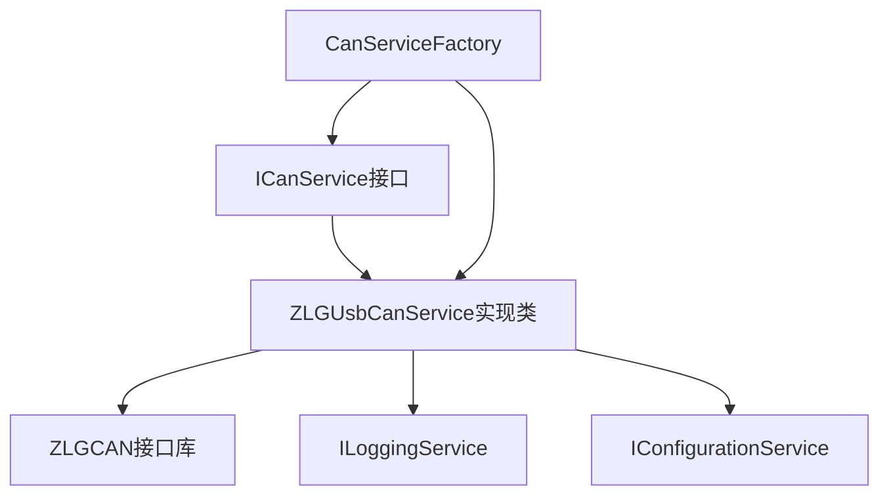

# CAN服务设计文档

## 1. 服务概述

CAN服务是BMS上位机软件的核心服务之一，负责与CAN硬件设备进行通信，基于致远电子ZLGCAN接口实现CAN/CAN FD报文的发送和接收，为上层应用提供统一的CAN通信接口。支持多种CAN设备类型，包括USBCAN、PCIECAN、CANET等系列产品。

## 2. 服务接口

```csharp
public interface ICanService
{
    /// <summary>
    /// 打开并初始化CAN设备
    /// </summary>
    /// <param name="deviceType">设备类型，如USBCAN-2E-U等</param>
    /// <param name="deviceIndex">设备索引</param>
    /// <param name="channelIndex">通道索引</param>
    /// <param name="config">CAN初始化配置</param>
    /// <returns>操作结果</returns>
    bool OpenDevice(uint deviceType, uint deviceIndex, uint channelIndex, CanInitConfig config);
    
    /// <summary>
    /// 关闭CAN设备
    /// </summary>
    /// <returns>操作结果</returns>
    bool CloseDevice();
    
    /// <summary>
    /// 启动CAN通道
    /// </summary>
    /// <returns>操作结果</returns>
    bool StartCAN();
    
    /// <summary>
    /// 停止CAN通道
    /// </summary>
    /// <returns>操作结果</returns>
    bool ResetCAN();
    
    /// <summary>
    /// 发送CAN报文
    /// </summary>
    /// <param name="message">要发送的CAN报文</param>
    /// <param name="transmitType">发送类型：0=正常发送，1=单次发送，2=自发自收，3=单次自发自收</param>
    /// <returns>发送成功的报文数量</returns>
    int SendMessage(CanMessage message, uint transmitType = 0);
    
    /// <summary>
    /// 批量发送CAN报文
    /// </summary>
    /// <param name="messages">CAN报文列表</param>
    /// <param name="transmitType">发送类型</param>
    /// <returns>发送成功的报文数量</returns>
    int SendMessages(List<CanMessage> messages, uint transmitType = 0);
    
    /// <summary>
    /// 发送CANFD报文
    /// </summary>
    /// <param name="message">要发送的CANFD报文</param>
    /// <param name="transmitType">发送类型</param>
    /// <returns>发送成功的报文数量</returns>
    int SendMessageFD(CanFdMessage message, uint transmitType = 0);
    
    /// <summary>
    /// 批量发送CANFD报文
    /// </summary>
    /// <param name="messages">CANFD报文列表</param>
    /// <param name="transmitType">发送类型</param>
    /// <returns>发送成功的报文数量</returns>
    int SendMessagesFD(List<CanFdMessage> messages, uint transmitType = 0);
    
    /// <summary>
    /// 接收CAN报文
    /// </summary>
    /// <param name="count">要接收的最大报文数量</param>
    /// <param name="waitTime">等待时间，单位毫秒，-1表示一直等待</param>
    /// <returns>接收到的报文列表</returns>
    List<CanMessage> ReceiveMessages(int count = 100, int waitTime = -1);
    
    /// <summary>
    /// 接收CANFD报文
    /// </summary>
    /// <param name="count">要接收的最大报文数量</param>
    /// <param name="waitTime">等待时间，单位毫秒</param>
    /// <returns>接收到的CANFD报文列表</returns>
    List<CanFdMessage> ReceiveMessagesFD(int count = 100, int waitTime = -1);
    
    /// <summary>
    /// 获取缓冲区中CAN报文数量
    /// </summary>
    /// <returns>CAN报文数量</returns>
    uint GetReceiveNum();
    
    /// <summary>
    /// 获取缓冲区中CANFD报文数量
    /// </summary>
    /// <returns>CANFD报文数量</returns>
    uint GetReceiveNumFD();
    
    /// <summary>
    /// 读取通道错误信息
    /// </summary>
    /// <returns>错误信息</returns>
    CanErrorInfo ReadChannelErrorInfo();
    
    /// <summary>
    /// 设置过滤器
    /// </summary>
    /// <param name="accCode">验收码</param>
    /// <param name="accMask">屏蔽码</param>
    /// <param name="filter">滤波方式，1=单滤波，0=双滤波</param>
    void SetFilter(uint accCode, uint accMask, byte filter = 0);
    
    /// <summary>
    /// 获取CAN设备属性
    /// </summary>
    /// <param name="propertyName">属性名称</param>
    /// <returns>属性值</returns>
    string GetDeviceProperty(string propertyName);
    
    /// <summary>
    /// 设置CAN设备属性
    /// </summary>
    /// <param name="propertyName">属性名称</param>
    /// <param name="value">属性值</param>
    /// <returns>操作结果</returns>
    bool SetDeviceProperty(string propertyName, string value);
    
    /// <summary>
    /// 报文接收事件
    /// </summary>
    event EventHandler<CanMessage> MessageReceived;
    
    /// <summary>
    /// CANFD报文接收事件
    /// </summary>
    event EventHandler<CanFdMessage> MessageFdReceived;
    
    /// <summary>
    /// 通道状态变化事件
    /// </summary>
    event EventHandler<CanChannelStatus> StatusChanged;
    
    /// <summary>
    /// 获取连接状态
    /// </summary>
    bool IsConnected { get; }
    
    /// <summary>
    /// 获取通道状态
    /// </summary>
    bool IsChannelStarted { get; }
    
    /// <summary>
    /// 获取当前设备信息
    /// </summary>
    CanDeviceInfo CurrentDevice { get; }
    
    /// <summary>
    /// 开始自动接收线程
    /// </summary>
    void StartAutoReceive();
    
    /// <summary>
    /// 停止自动接收线程
    /// </summary>
    void StopAutoReceive();
}
```

## 3. 实现类设计

### 3.1 ZLGUsbCanService

```csharp
public class ZLGUsbCanService : ICanService, IDisposable
{
    // 设备句柄
    private IntPtr _deviceHandle = IntPtr.Zero;
    // 通道句柄
    private IntPtr _channelHandle = IntPtr.Zero;
    // 当前设备信息
    private CanDeviceInfo _currentDevice;
    // 自动接收线程
    private Thread _receiveThread;
    // 线程停止标志
    private volatile bool _shouldStop;
    // 事件锁
    private object _eventLock = new object();
    // 日志服务
    private readonly ILoggingService _loggingService;
    
    // 构造函数
    public ZLGUsbCanService(ILoggingService loggingService)
    {
        _loggingService = loggingService;
        _shouldStop = true;
    }
    
    // 实现ICanService接口的所有方法
    // 使用致远USBCAN FD SDK实现CAN通信
    
    // 实现IDisposable接口
    public void Dispose()
    {
        StopAutoReceive();
        CloseDevice();
    }
    
    // 内部方法：检查SDK版本
    private bool CheckSDKVersion()
    {
        // 实现SDK版本检查逻辑
    }
    
    // 内部方法：初始化接收线程
    private void InitializeReceiveThread()
    {
        _receiveThread = new Thread(ReceiveLoop)
        {
            IsBackground = true,
            Name = "CAN Receive Thread"
        };
    }
    
    // 内部方法：接收循环
    private void ReceiveLoop()
    {
        while (!_shouldStop)
        {
            try
            {
                // 实现CAN报文接收循环
            }
            catch (Exception ex)
            {
                _loggingService.LogError("CAN接收线程异常", ex);
                Thread.Sleep(100);
            }
        }
    }
}
```

### 3.2 CanServiceFactory

```csharp
public class CanServiceFactory
{
    private static readonly Dictionary<string, Type> _serviceTypes = new Dictionary<string, Type>()
    {
        { "ZLG", typeof(ZLGUsbCanService) }
    };
    
    public static ICanService CreateCanService(string serviceType, IServiceProvider serviceProvider)
    {
        if (_serviceTypes.TryGetValue(serviceType, out Type type))
        {
            return (ICanService)Activator.CreateInstance(type, serviceProvider.GetService(typeof(ILoggingService)));
        }
        return new ZLGUsbCanService((ILoggingService)serviceProvider.GetService(typeof(ILoggingService)));
    }
    
    // 获取支持的设备类型列表
    public static List<string> GetSupportedDeviceTypes()
    {
        return new List<string>()
        {
            "USBCAN-1", "USBCAN-2", "USBCAN-E-U", "USBCAN-2E-U",
            "PCIECANFD-100U", "PCIECANFD-200U", "PCIECANFD-400U",
            "USBCANFD-200U", "USBCANFD-100U", "USBCANFD-MINI",
            "CANETUDP", "CANETTCP", "CLOUD"
        };
    }
}
```

## 4. 数据模型引用

### 4.1 CanMessage

```csharp
public class CanMessage
{
    /// <summary>
    /// 帧ID
    /// </summary>
    public uint Id { get; set; }
    
    /// <summary>
    /// 是否为扩展帧
    /// </summary>
    public bool IsExtendedFrame { get; set; }
    
    /// <summary>
    /// 是否为远程帧
    /// </summary>
    public bool IsRemoteFrame { get; set; }
    
    /// <summary>
    /// 数据长度
    /// </summary>
    public byte DLC { get; set; }
    
    /// <summary>
    /// 报文数据
    /// </summary>
    public byte[] Data { get; set; }
    
    /// <summary>
    /// 时间戳（微秒）
    /// </summary>
    public ulong Timestamp { get; set; }
    
    /// <summary>
    /// 通道索引
    /// </summary>
    public uint ChannelIndex { get; set; }
    
    /// <summary>
    /// 转换为ZLGCAN的can_frame结构
    /// </summary>
    public can_frame ToCanFrame()
    {
        // 实现转换逻辑
    }
    
    /// <summary>
    /// 从ZLGCAN的can_frame结构创建
    /// </summary>
    public static CanMessage FromCanFrame(can_frame frame, ulong timestamp = 0)
    {
        // 实现创建逻辑
    }
}
```

### 4.2 CanFdMessage

```csharp
public class CanFdMessage
{
    /// <summary>
    /// 帧ID
    /// </summary>
    public uint Id { get; set; }
    
    /// <summary>
    /// 是否为扩展帧
    /// </summary>
    public bool IsExtendedFrame { get; set; }
    
    /// <summary>
    /// 是否为远程帧
    /// </summary>
    public bool IsRemoteFrame { get; set; }
    
    /// <summary>
    /// 数据长度
    /// </summary>
    public byte Length { get; set; }
    
    /// <summary>
    /// 额外标志（如CANFD_BRS等）
    /// </summary>
    public byte Flags { get; set; }
    
    /// <summary>
    /// 报文数据
    /// </summary>
    public byte[] Data { get; set; }
    
    /// <summary>
    /// 时间戳（微秒）
    /// </summary>
    public ulong Timestamp { get; set; }
    
    /// <summary>
    /// 通道索引
    /// </summary>
    public uint ChannelIndex { get; set; }
    
    /// <summary>
    /// 转换为ZLGCAN的canfd_frame结构
    /// </summary>
    public canfd_frame ToCanFdFrame()
    {
        // 实现转换逻辑
    }
    
    /// <summary>
    /// 从ZLGCAN的canfd_frame结构创建
    /// </summary>
    public static CanFdMessage FromCanFdFrame(canfd_frame frame, ulong timestamp = 0)
    {
        // 实现创建逻辑
    }
}
```

### 4.3 CanInitConfig

```csharp
public class CanInitConfig
{
    /// <summary>
    /// 设备类型：CAN或CANFD
    /// </summary>
    public uint CanType { get; set; }
    
    /// <summary>
    /// 验收码
    /// </summary>
    public uint AccCode { get; set; }
    
    /// <summary>
    /// 屏蔽码
    /// </summary>
    public uint AccMask { get; set; }
    
    /// <summary>
    /// 滤波方式
    /// </summary>
    public byte Filter { get; set; }
    
    /// <summary>
    /// 工作模式
    /// </summary>
    public byte Mode { get; set; }
    
    /// <summary>
    /// 波特率设置（CAN）
    /// </summary>
    public CanBaudRateConfig BaudRate { get; set; }
    
    /// <summary>
    /// CANFD设置
    /// </summary>
    public CanFdBaudRateConfig CanFdBaudRate { get; set; }
    
    /// <summary>
    /// 转换为ZCAN_CHANNEL_INIT_CONFIG结构
    /// </summary>
    public ZCAN_CHANNEL_INIT_CONFIG ToZCanInitConfig()
    {
        // 实现转换逻辑
    }
}
```

### 4.4 CanDeviceInfo

```csharp
public class CanDeviceInfo
{
    /// <summary>
    /// 设备类型
    /// </summary>
    public uint DeviceType { get; set; }
    
    /// <summary>
    /// 设备索引
    /// </summary>
    public uint DeviceIndex { get; set; }
    
    /// <summary>
    /// 通道索引
    /// </summary>
    public uint ChannelIndex { get; set; }
    
    /// <summary>
    /// 设备类型名称
    /// </summary>
    public string DeviceTypeName { get; set; }
    
    /// <summary>
    /// 设备序列号
    /// </summary>
    public string SerialNumber { get; set; }
    
    /// <summary>
    /// 固件版本
    /// </summary>
    public string FirmwareVersion { get; set; }
    
    /// <summary>
    /// 通道状态
    /// </summary>
    public bool IsStarted { get; set; }
}

### 4.5 CanErrorInfo

```csharp
public class CanErrorInfo
{
    /// <summary>
    /// 错误码
    /// </summary>
    public uint ErrorCode { get; set; }
    
    /// <summary>
    /// 消极错误数据
    /// </summary>
    public byte[] PassiveErrorData { get; set; }
    
    /// <summary>
    /// 仲裁丢失错误数据
    /// </summary>
    public byte ArbitrationLostErrorData { get; set; }
    
    /// <summary>
    /// 错误描述
    /// </summary>
    public string ErrorDescription { get; set; }
}
```

### 4.6 CanChannelStatus

```csharp
public class CanChannelStatus
{
    /// <summary>
    /// 通道索引
    /// </summary>
    public uint ChannelIndex { get; set; }
    
    /// <summary>
    /// 是否已启动
    /// </summary>
    public bool IsStarted { get; set; }
    
    /// <summary>
    /// 状态变化类型
    /// </summary>
    public ChannelStatusChangeType ChangeType { get; set; }
    
    /// <summary>
    /// 错误信息（如果有）
    /// </summary>
    public string ErrorMessage { get; set; }
}

public enum ChannelStatusChangeType
{
    Started,
    Stopped,
    Error,
    Recovered
}

## 5. 关键功能实现

### 5.1 设备操作功能

#### 5.1.1 设备打开与关闭
```csharp
// 实现OpenDevice方法
public bool OpenDevice(uint deviceType, uint deviceIndex)
{
    try
    {
        // 关闭已打开的设备
        if (_deviceHandle != IntPtr.Zero)
        {
            CloseDevice();
        }
        
        // 调用ZLGCAN接口打开设备
        _deviceHandle = ZCAN_OpenDevice(deviceType, deviceIndex, 0);
        
        if (_deviceHandle == IntPtr.Zero)
        {
            _loggingService.LogError("打开设备失败");
            return false;
        }
        
        _currentDevice = new CanDeviceInfo
        {
            DeviceType = deviceType,
            DeviceIndex = deviceIndex,
            DeviceTypeName = GetDeviceTypeName(deviceType),
            IsStarted = false
        };
        
        _loggingService.LogInfo($"成功打开设备：{_currentDevice.DeviceTypeName}，索引：{deviceIndex}");
        return true;
    }
    catch (Exception ex)
    {
        _loggingService.LogError("打开设备时发生异常", ex);
        return false;
    }
}

// 实现CloseDevice方法
public bool CloseDevice()
{
    try
    {
        // 停止自动接收
        StopAutoReceive();
        
        // 停止通道
        if (_channelHandle != IntPtr.Zero)
        {
            ZCAN_StopCAN(_channelHandle);
            _channelHandle = IntPtr.Zero;
        }
        
        // 关闭设备
        bool result = true;
        if (_deviceHandle != IntPtr.Zero)
        {
            result = ZCAN_CloseDevice(_deviceHandle) == STATUS_OK;
            if (result)
            {
                _loggingService.LogInfo("成功关闭设备");
            }
            else
            {
                _loggingService.LogError("关闭设备失败");
            }
            _deviceHandle = IntPtr.Zero;
        }
        
        _currentDevice = null;
        return result;
    }
    catch (Exception ex)
    {
        _loggingService.LogError("关闭设备时发生异常", ex);
        return false;
    }
}

// 获取设备类型名称
private string GetDeviceTypeName(uint deviceType)
{
    switch (deviceType)
    {
        case ZCAN_USBCANFD_200U:
            return "USBCANFD-200U";
        case ZCAN_USBCANFD_100U:
            return "USBCANFD-100U";
        case ZCAN_USBCANFD_MINI:
            return "USBCANFD-MINI";
        case ZCAN_USBCAN_2E_U:
            return "USBCAN-2E-U";
        case ZCAN_USBCAN_E_U:
            return "USBCAN-E-U";
        case ZCAN_CANFDNET_400U_TCP:
        case ZCAN_CANFDNET_400U_UDP:
            return "CANFDNet-400U";
        default:
            return $"未知设备类型({deviceType})";
    }
}
```

#### 5.1.2 设备属性管理
```csharp
// 获取设备属性
public bool GetDeviceProperty(uint deviceType, uint deviceIndex, int propertyId, out object propertyValue)
{
    try
    {
        // 根据属性ID获取设备属性
        // 使用ZLGCAN接口的相关函数
        // ...
        
        propertyValue = null; // 示例返回值
        return true;
    }
    catch (Exception ex)
    {
        _loggingService.LogError("获取设备属性时发生异常", ex);
        propertyValue = null;
        return false;
    }
}

// 设置设备属性
public bool SetDeviceProperty(uint deviceType, uint deviceIndex, int propertyId, object propertyValue)
{
    try
    {
        // 根据属性ID设置设备属性
        // 使用ZLGCAN接口的相关函数
        // ...
        
        return true;
    }
    catch (Exception ex)
    {
        _loggingService.LogError("设置设备属性时发生异常", ex);
        return false;
    }
}
```

### 5.2 通道管理功能

#### 5.2.1 通道初始化与控制
```csharp
// 实现InitCAN方法
public bool InitCAN(uint channelIndex, CanInitConfig config)
{
    try
    {
        if (_deviceHandle == IntPtr.Zero)
        {
            _loggingService.LogError("设备未打开，无法初始化CAN通道");
            return false;
        }
        
        // 停止已初始化的通道
        if (_channelHandle != IntPtr.Zero)
        {
            ZCAN_StopCAN(_channelHandle);
            _channelHandle = IntPtr.Zero;
        }
        
        // 转换配置参数
        ZCAN_CHANNEL_INIT_CONFIG initConfig = config.ToZCanInitConfig();
        
        // 打开通道
        _channelHandle = ZCAN_InitCAN(_deviceHandle, channelIndex, ref initConfig);
        
        if (_channelHandle == IntPtr.Zero)
        {
            _loggingService.LogError($"初始化CAN通道{channelIndex}失败");
            return false;
        }
        
        // 更新设备信息
        if (_currentDevice != null)
        {
            _currentDevice.ChannelIndex = channelIndex;
            _currentDevice.IsStarted = false;
        }
        
        _loggingService.LogInfo($"成功初始化CAN通道{channelIndex}");
        return true;
    }
    catch (Exception ex)
    {
        _loggingService.LogError($"初始化CAN通道{channelIndex}时发生异常", ex);
        return false;
    }
}

// 实现StartCAN方法
public bool StartCAN()
{
    try
    {
        if (_channelHandle == IntPtr.Zero)
        {
            _loggingService.LogError("CAN通道未初始化，无法启动");
            return false;
        }
        
        bool result = ZCAN_StartCAN(_channelHandle) == STATUS_OK;
        
        if (result)
        {
            _loggingService.LogInfo("成功启动CAN通道");
            if (_currentDevice != null)
            {
                _currentDevice.IsStarted = true;
            }
            
            // 触发状态变化事件
            OnChannelStatusChanged(new CanChannelStatus
            {
                ChannelIndex = _currentDevice?.ChannelIndex ?? 0,
                IsStarted = true,
                ChangeType = ChannelStatusChangeType.Started
            });
        }
        else
        {
            _loggingService.LogError("启动CAN通道失败");
        }
        
        return result;
    }
    catch (Exception ex)
    {
        _loggingService.LogError("启动CAN通道时发生异常", ex);
        return false;
    }
}

// 实现StopCAN方法
public bool StopCAN()
{
    try
    {
        if (_channelHandle == IntPtr.Zero)
        {
            _loggingService.LogWarning("CAN通道未初始化或已停止");
            return true;
        }
        
        // 停止自动接收
        StopAutoReceive();
        
        bool result = ZCAN_StopCAN(_channelHandle) == STATUS_OK;
        
        if (result)
        {
            _loggingService.LogInfo("成功停止CAN通道");
            if (_currentDevice != null)
            {
                _currentDevice.IsStarted = false;
            }
            
            // 触发状态变化事件
            OnChannelStatusChanged(new CanChannelStatus
            {
                ChannelIndex = _currentDevice?.ChannelIndex ?? 0,
                IsStarted = false,
                ChangeType = ChannelStatusChangeType.Stopped
            });
        }
        else
        {
            _loggingService.LogError("停止CAN通道失败");
        }
        
        return result;
    }
    catch (Exception ex)
    {
        _loggingService.LogError("停止CAN通道时发生异常", ex);
        return false;
    }
}

// 实现ResetCAN方法
public bool ResetCAN()
{
    try
    {
        if (_channelHandle == IntPtr.Zero)
        {
            _loggingService.LogError("CAN通道未初始化，无法重置");
            return false;
        }
        
        // 停止自动接收
        StopAutoReceive();
        
        bool result = ZCAN_ResetCAN(_channelHandle) == STATUS_OK;
        
        if (result)
        {
            _loggingService.LogInfo("成功重置CAN通道");
            // 重置后需要重新启动通道
            StartCAN();
        }
        else
        {
            _loggingService.LogError("重置CAN通道失败");
        }
        
        return result;
    }
    catch (Exception ex)
    {
        _loggingService.LogError("重置CAN通道时发生异常", ex);
        return false;
    }
}
```

#### 5.2.2 通道状态监控
```csharp
// 获取通道状态
public bool GetChannelStatus(out CanChannelStatus status)
{
    try
    {
        status = new CanChannelStatus
        {
            ChannelIndex = _currentDevice?.ChannelIndex ?? 0,
            IsStarted = _currentDevice?.IsStarted ?? false,
            ChangeType = ChannelStatusChangeType.Stopped
        };
        
        if (_currentDevice != null && _currentDevice.IsStarted)
        {
            status.ChangeType = ChannelStatusChangeType.Started;
            
            // 读取通道错误信息
            CanErrorInfo errorInfo = ReadChannelErrInfo();
            if (errorInfo != null && errorInfo.ErrorCode > 0)
            {
                status.ChangeType = ChannelStatusChangeType.Error;
                status.ErrorMessage = errorInfo.ErrorDescription;
            }
        }
        
        return true;
    }
    catch (Exception ex)
    {
        _loggingService.LogError("获取通道状态时发生异常", ex);
        status = null;
        return false;
    }
}
```

### 5.3 报文发送功能

#### 5.3.1 CAN报文发送
```csharp
// 实现SendMessage方法
public int SendMessage(CanMessage message)
{
    try
    {
        if (_channelHandle == IntPtr.Zero || !(_currentDevice?.IsStarted ?? false))
        {
            _loggingService.LogError("CAN通道未初始化或未启动，无法发送报文");
            return 0;
        }
        
        // 转换为ZLGCAN的can_frame结构
        can_frame frame = message.ToCanFrame();
        
        // 准备发送数据
        ZCAN_Transmit_Data transmitData = new ZCAN_Transmit_Data
        {
            frame = frame,
            reserved = 0 // 预留字段
        };
        
        // 发送报文
        int sendCount = ZCAN_Transmit(_deviceHandle, _currentDevice?.ChannelIndex ?? 0, ref transmitData, 1);
        
        if (sendCount > 0)
        {
            _loggingService.LogDebug($"成功发送CAN报文，ID: {message.Id:X8}");
        }
        else
        {
            _loggingService.LogWarning($"发送CAN报文失败，ID: {message.Id:X8}");
        }
        
        return sendCount;
    }
    catch (Exception ex)
    {
        _loggingService.LogError("发送CAN报文时发生异常", ex);
        return 0;
    }
}

// 实现批量发送方法
public int SendMessages(List<CanMessage> messages)
{
    try
    {
        if (_channelHandle == IntPtr.Zero || !(_currentDevice?.IsStarted ?? false))
        {
            _loggingService.LogError("CAN通道未初始化或未启动，无法发送批量报文");
            return 0;
        }
        
        if (messages == null || messages.Count == 0)
        {
            return 0;
        }
        
        // 准备发送数据
        ZCAN_Transmit_Data[] transmitDatas = new ZCAN_Transmit_Data[messages.Count];
        for (int i = 0; i < messages.Count; i++)
        {
            transmitDatas[i] = new ZCAN_Transmit_Data
            {
                frame = messages[i].ToCanFrame(),
                reserved = 0 // 预留字段
            };
        }
        
        // 批量发送
        int sendCount = ZCAN_Transmit(_deviceHandle, _currentDevice?.ChannelIndex ?? 0, transmitDatas, (uint)messages.Count);
        
        _loggingService.LogDebug($"批量发送CAN报文：共{messages.Count}个，成功{sendCount}个");
        return sendCount;
    }
    catch (Exception ex)
    {
        _loggingService.LogError("批量发送CAN报文时发生异常", ex);
        return 0;
    }
}
```

#### 5.3.2 CANFD报文发送
```csharp
// 实现SendMessageFD方法
public int SendMessageFD(CanFdMessage message)
{
    try
    {
        if (_channelHandle == IntPtr.Zero || !(_currentDevice?.IsStarted ?? false))
        {
            _loggingService.LogError("CAN通道未初始化或未启动，无法发送CANFD报文");
            return 0;
        }
        
        // 转换为ZLGCAN的canfd_frame结构
        canfd_frame frame = message.ToCanFdFrame();
        
        // 准备发送数据
        ZCAN_TransmitFD_Data transmitData = new ZCAN_TransmitFD_Data
        {
            frame = frame,
            reserved = 0 // 预留字段
        };
        
        // 发送CANFD报文
        int sendCount = ZCAN_TransmitFD(_deviceHandle, _currentDevice?.ChannelIndex ?? 0, ref transmitData, 1);
        
        if (sendCount > 0)
        {
            _loggingService.LogDebug($"成功发送CANFD报文，ID: {message.Id:X8}");
        }
        else
        {
            _loggingService.LogWarning($"发送CANFD报文失败，ID: {message.Id:X8}");
        }
        
        return sendCount;
    }
    catch (Exception ex)
    {
        _loggingService.LogError("发送CANFD报文时发生异常", ex);
        return 0;
    }
}

// 批量发送CANFD报文
public int SendMessagesFD(List<CanFdMessage> messages)
{
    try
    {
        if (_channelHandle == IntPtr.Zero || !(_currentDevice?.IsStarted ?? false))
        {
            _loggingService.LogError("CAN通道未初始化或未启动，无法发送批量CANFD报文");
            return 0;
        }
        
        if (messages == null || messages.Count == 0)
        {
            return 0;
        }
        
        // 准备发送数据
        ZCAN_TransmitFD_Data[] transmitDatas = new ZCAN_TransmitFD_Data[messages.Count];
        for (int i = 0; i < messages.Count; i++)
        {
            transmitDatas[i] = new ZCAN_TransmitFD_Data
            {
                frame = messages[i].ToCanFdFrame(),
                reserved = 0 // 预留字段
            };
        }
        
        // 批量发送
        int sendCount = ZCAN_TransmitFD(_deviceHandle, _currentDevice?.ChannelIndex ?? 0, transmitDatas, (uint)messages.Count);
        
        _loggingService.LogDebug($"批量发送CANFD报文：共{messages.Count}个，成功{sendCount}个");
        return sendCount;
    }
    catch (Exception ex)
    {
        _loggingService.LogError("批量发送CANFD报文时发生异常", ex);
        return 0;
    }
}
```

### 5.4 报文接收功能

#### 5.4.1 自动接收机制
```csharp
// 实现StartAutoReceive方法
public bool StartAutoReceive(uint receiveIntervalMs = 10)
{
    try
    {
        if (_channelHandle == IntPtr.Zero || !(_currentDevice?.IsStarted ?? false))
        {
            _loggingService.LogError("CAN通道未初始化或未启动，无法开始自动接收");
            return false;
        }
        
        if (!_shouldStop && _receiveThread != null && _receiveThread.IsAlive)
        {
            _loggingService.LogWarning("自动接收线程已经在运行");
            return true;
        }
        
        // 初始化接收线程
        _shouldStop = false;
        InitializeReceiveThread();
        
        // 启动接收线程
        _receiveThread.Start();
        _loggingService.LogInfo("成功启动CAN自动接收线程");
        return true;
    }
    catch (Exception ex)
    {
        _loggingService.LogError("启动CAN自动接收线程时发生异常", ex);
        _shouldStop = true;
        return false;
    }
}

// 实现StopAutoReceive方法
public void StopAutoReceive()
{
    try
    {
        if (_shouldStop || _receiveThread == null)
        {
            return;
        }
        
        _shouldStop = true;
        
        // 等待接收线程结束
        if (_receiveThread.IsAlive)
        {
            _receiveThread.Join(1000); // 等待最多1秒
        }
        
        _loggingService.LogInfo("CAN自动接收线程已停止");
    }
    catch (Exception ex)
    {
        _loggingService.LogError("停止CAN自动接收线程时发生异常", ex);
    }
}
```

#### 5.4.2 手动接收方法
```csharp
// 实现ReceiveMessage方法
public List<CanMessage> ReceiveMessage(uint maxCount = 100)
{
    try
    {
        if (_channelHandle == IntPtr.Zero || !(_currentDevice?.IsStarted ?? false))
        {
            _loggingService.LogError("CAN通道未初始化或未启动，无法接收报文");
            return new List<CanMessage>();
        }
        
        // 准备接收缓冲区
        ZCAN_Receive_Data[] receiveDatas = new ZCAN_Receive_Data[maxCount];
        
        // 接收报文
        int receivedCount = ZCAN_Receive(_deviceHandle, _currentDevice?.ChannelIndex ?? 0, receiveDatas, maxCount);
        
        if (receivedCount == 0)
        {
            return new List<CanMessage>();
        }
        
        // 转换为CanMessage对象
        List<CanMessage> messages = new List<CanMessage>(receivedCount);
        for (int i = 0; i < receivedCount; i++)
        {
            CanMessage message = CanMessage.FromCanFrame(receiveDatas[i].frame, receiveDatas[i].timestamp);
            message.ChannelIndex = _currentDevice?.ChannelIndex ?? 0;
            messages.Add(message);
        }
        
        return messages;
    }
    catch (Exception ex)
    {
        _loggingService.LogError("接收CAN报文时发生异常", ex);
        return new List<CanMessage>();
    }
}

// 实现ReceiveMessageFD方法
public List<CanFdMessage> ReceiveMessageFD(uint maxCount = 100)
{
    try
    {
        if (_channelHandle == IntPtr.Zero || !(_currentDevice?.IsStarted ?? false))
        {
            _loggingService.LogError("CAN通道未初始化或未启动，无法接收CANFD报文");
            return new List<CanFdMessage>();
        }
        
        // 准备接收缓冲区
        ZCAN_ReceiveFD_Data[] receiveDatas = new ZCAN_ReceiveFD_Data[maxCount];
        
        // 接收CANFD报文
        int receivedCount = ZCAN_ReceiveFD(_deviceHandle, _currentDevice?.ChannelIndex ?? 0, receiveDatas, maxCount);
        
        if (receivedCount == 0)
        {
            return new List<CanFdMessage>();
        }
        
        // 转换为CanFdMessage对象
        List<CanFdMessage> messages = new List<CanFdMessage>(receivedCount);
        for (int i = 0; i < receivedCount; i++)
        {
            CanFdMessage message = CanFdMessage.FromCanFdFrame(receiveDatas[i].frame, receiveDatas[i].timestamp);
            message.ChannelIndex = _currentDevice?.ChannelIndex ?? 0;
            messages.Add(message);
        }
        
        return messages;
    }
    catch (Exception ex)
    {
        _loggingService.LogError("接收CANFD报文时发生异常", ex);
        return new List<CanFdMessage>();
    }
}
```

### 5.5 错误处理功能

```csharp
// 实现ReadChannelErrInfo方法
public CanErrorInfo ReadChannelErrInfo()
{
    try
    {
        if (_channelHandle == IntPtr.Zero)
        {
            _loggingService.LogError("CAN通道未初始化，无法读取错误信息");
            return null;
        }
        
        // 读取通道错误信息
        ZCAN_ERR_INFO errInfo = new ZCAN_ERR_INFO();
        bool result = ZCAN_ReadChannelErrInfo(_deviceHandle, _currentDevice?.ChannelIndex ?? 0, ref errInfo) == STATUS_OK;
        
        if (!result)
        {
            _loggingService.LogWarning("读取CAN通道错误信息失败");
            return null;
        }
        
        // 转换为CanErrorInfo对象
        CanErrorInfo errorInfo = new CanErrorInfo
        {
            ErrorCode = errInfo.ErrCode,
            PassiveErrorData = new byte[] { errInfo.PassiveErrData },
            ArbitrationLostErrorData = errInfo.ArLostErrData,
            ErrorDescription = GetErrorDescription(errInfo.ErrCode)
        };
        
        return errorInfo;
    }
    catch (Exception ex)
    {
        _loggingService.LogError("读取CAN通道错误信息时发生异常", ex);
        return null;
    }
}

// 获取错误描述
private string GetErrorDescription(uint errorCode)
{
    switch (errorCode)
    {
        case ERR_CAN_BUS_OFF:
            return "CAN总线关闭(Bus Off)";
        case ERR_CAN_ERROR_PASSIVE:
            return "CAN错误被动状态";
        case ERR_CAN_ERROR_WARNING:
            return "CAN错误警告";
        case ERR_CAN_DATA_OVERRUN:
            return "CAN数据溢出";
        case ERR_CAN_ARBITRATION_LOST:
            return "CAN仲裁丢失";
        case ERR_CAN_RECEIVE_BUFFER_EMPTY:
            return "CAN接收缓冲区为空";
        case ERR_CAN_NO_DEVICE:
            return "未找到设备";
        case ERR_CAN_CONFIGURATION:
            return "CAN配置错误";
        default:
            return $"未知错误({errorCode})";
    }
}
```

### 5.6 波特率配置支持

```csharp
// 标准波特率配置
public static class CanBaudRatePresets
{
    public static CanBaudRateConfig BaudRate100Kbps => new CanBaudRateConfig
    {
        Prescaler = 20,
        TimeSeg1 = 13,
        TimeSeg2 = 2,
        SJW = 1,
        SamplePoint = 80.0 // 80%采样点
    };
    
    public static CanBaudRateConfig BaudRate250Kbps => new CanBaudRateConfig
    {
        Prescaler = 8,
        TimeSeg1 = 13,
        TimeSeg2 = 2,
        SJW = 1,
        SamplePoint = 80.0
    };
    
    public static CanBaudRateConfig BaudRate500Kbps => new CanBaudRateConfig
    {
        Prescaler = 4,
        TimeSeg1 = 13,
        TimeSeg2 = 2,
        SJW = 1,
        SamplePoint = 80.0
    };
    
    public static CanBaudRateConfig BaudRate1Mbps => new CanBaudRateConfig
    {
        Prescaler = 2,
        TimeSeg1 = 13,
        TimeSeg2 = 2,
        SJW = 1,
        SamplePoint = 80.0
    };
    
    // 获取预设波特率配置
    public static CanBaudRateConfig GetPresetBaudRate(int baudRate)
    {
        switch (baudRate)
        {
            case 100000:
                return BaudRate100Kbps;
            case 250000:
                return BaudRate250Kbps;
            case 500000:
                return BaudRate500Kbps;
            case 1000000:
                return BaudRate1Mbps;
            default:
                throw new ArgumentException($"不支持的波特率: {baudRate}");
        }
    }
}

// CANFD双波特率配置
public static class CanFdBaudRatePresets
{
    // 标称比特率(Nominal) 500Kbps，数据比特率(Data) 2Mbps
    public static CanFdBaudRateConfig BaudRate500Kbps_2Mbps => new CanFdBaudRateConfig
    {
        NominalBaudRate = CanBaudRatePresets.BaudRate500Kbps,
        DataBaudRate = new CanBaudRateConfig
        {
            Prescaler = 1,
            TimeSeg1 = 13,
            TimeSeg2 = 2,
            SJW = 1,
            SamplePoint = 80.0
        },
        UseDataBaudRate = true,
        DataBitRateSwitch = true
    };
    
    // 标称比特率 250Kbps，数据比特率 1Mbps
    public static CanFdBaudRateConfig BaudRate250Kbps_1Mbps => new CanFdBaudRateConfig
    {
        NominalBaudRate = CanBaudRatePresets.BaudRate250Kbps,
        DataBaudRate = CanBaudRatePresets.BaudRate1Mbps,
        UseDataBaudRate = true,
        DataBitRateSwitch = true
    };
}

## 6. 性能优化策略

### 6.1 报文接收优化

```csharp
// 优化接收线程实现
private void InitializeReceiveThread()
{
    _receiveThread = new Thread(() =>
    {
        while (!_shouldStop)
        {
            try
            {
                // 批量接收CAN报文
                ReceiveBatchMessages();
                
                // 批量接收CANFD报文
                ReceiveBatchFDMessages();
                
                // 短暂休眠，避免CPU占用过高
                Thread.Sleep(1);
            }
            catch (Exception ex)
            {
                _loggingService.LogError("自动接收线程发生异常", ex);
                // 短暂休眠后继续，避免异常循环导致CPU占用过高
                Thread.Sleep(100);
            }
        }
    })
    {
        IsBackground = true,
        Name = "CAN_AutoReceiveThread"
    };
}

// 批量接收CAN报文优化
private void ReceiveBatchMessages()
{
    if (_channelHandle == IntPtr.Zero || !(_currentDevice?.IsStarted ?? false))
    {
        return;
    }
    
    // 使用预分配的缓冲区数组，减少GC压力
            ZCAN_Receive_Data[] receiveDatas = new ZCAN_Receive_Data[1000]; // 单次最多接收1000个报文
            
            // 批量接收
            int receivedCount = ZCAN_Receive(_deviceHandle, _currentDevice?.ChannelIndex ?? 0, receiveDatas, 1000);
            
            if (receivedCount <= 0)
            {
                return;
            }
    
    if (receivedCount > 0)
    {
        // 预先分配消息列表，减少内存重分配
        List<CanMessage> messages = new List<CanMessage>(receivedCount);
        
        // 批量转换并添加到列表
        for (int i = 0; i < receivedCount; i++)
        {
            CanMessage message = CanMessage.FromCanFrame(receiveDatas[i].frame, receiveDatas[i].timestamp);
            message.ChannelIndex = _currentDevice?.ChannelIndex ?? 0;
            messages.Add(message);
        }
        
        // 批量触发接收事件，减少事件调度开销
        OnMessagesReceived(messages);
        
        // 记录统计信息
        _receivedMessageCount += receivedCount;
    }
}

// 批量接收CANFD报文优化
private void ReceiveBatchFDMessages()
{
    // 类似CAN报文接收的优化实现
    // ...
}
```

### 6.2 内存管理优化

```csharp
// 内存池和对象缓存机制
private class MessageObjectPool<T> where T : class, new()
{
    private readonly ConcurrentBag<T> _pool = new ConcurrentBag<T>();
    
    public T Get()
    {
        return _pool.TryTake(out var item) ? item : new T();
    }
    
    public void Return(T item)
    {
        // 重置对象状态
        ResetObject(item);
        _pool.Add(item);
    }
    
    private void ResetObject(T item)
    {
        // 根据不同类型实现对象重置
        if (item is CanMessage message)
        {
            message.Id = 0;
            message.IsExtendedFrame = false;
            message.IsRemoteFrame = false;
            message.IsErrorFrame = false;
            message.DataLength = 0;
            Array.Clear(message.Data, 0, message.Data.Length);
            message.Timestamp = 0;
        }
        // 其他类型的重置...
    }
}

// 使用对象池优化频繁创建和销毁的对象
private readonly MessageObjectPool<CanMessage> _messagePool = new MessageObjectPool<CanMessage>();

// 在发送和接收中使用对象池
public CanMessage CreateMessage()
{
    return _messagePool.Get();
}

public void RecycleMessage(CanMessage message)
{
    _messagePool.Return(message);
}
```

### 6.3 异步操作优化

```csharp
// 异步发送方法实现
public async Task<int> SendMessageAsync(CanMessage message, CancellationToken cancellationToken = default)
{
    // 使用Task.Run确保UI线程不被阻塞
    return await Task.Run(() => SendMessage(message), cancellationToken);
}

public async Task<int> SendMessagesAsync(List<CanMessage> messages, CancellationToken cancellationToken = default)
{
    // 对于大量报文，分批异步发送
    const int batchSize = 100;
    int totalSent = 0;
    
    for (int i = 0; i < messages.Count; i += batchSize)
    {
        cancellationToken.ThrowIfCancellationRequested();
        
        int currentBatchSize = Math.Min(batchSize, messages.Count - i);
        List<CanMessage> batch = messages.GetRange(i, currentBatchSize);
        
        totalSent += await Task.Run(() => SendMessages(batch), cancellationToken);
        
        // 短暂延迟，避免发送过快导致缓冲区溢出
        await Task.Delay(5, cancellationToken);
    }
    
    return totalSent;
}
```

### 6.4 缓冲区管理优化

```csharp
// 实现发送缓冲区和流量控制
private class SendBufferManager
{
    private readonly ConcurrentQueue<CanMessage> _messageQueue = new ConcurrentQueue<CanMessage>();
    private readonly ICanService _canService;
    private readonly int _maxQueueSize;
    private bool _isProcessing;
    
    public SendBufferManager(ICanService canService, int maxQueueSize = 10000)
    {
        _canService = canService;
        _maxQueueSize = maxQueueSize;
    }
    
    public bool EnqueueMessage(CanMessage message)
    {
        // 队列大小控制，防止内存溢出
        if (_messageQueue.Count >= _maxQueueSize)
        {
            return false;
        }
        
        _messageQueue.Enqueue(message);
        StartProcessing();
        return true;
    }
    
    private void StartProcessing()
    {
        if (!_isProcessing)
        {
            _isProcessing = true;
            Task.Run(ProcessQueue);
        }
    }
    
    private async Task ProcessQueue()
    {
        try
        {
            const int batchSize = 10;
            var batch = new List<CanMessage>(batchSize);
            
            while (_messageQueue.TryDequeue(out var message))
            {
                batch.Add(message);
                
                if (batch.Count >= batchSize || _messageQueue.IsEmpty)
                {
                    await _canService.SendMessagesAsync(batch);
                    batch.Clear();
                    
                    // 短暂延迟，控制发送频率
                    await Task.Delay(1);
                }
            }
        }
        finally
        {
            _isProcessing = false;
        }
    }
}
```

## 7. 依赖关系

### 7.1 外部依赖

- **致远电子ZLGCAN接口库**：提供底层硬件访问能力，包括设备操作、通道管理、报文收发等功能
- **System.Threading.Tasks**：用于实现异步操作和多线程处理
- **System.Collections.Concurrent**：用于实现线程安全的集合和队列

### 7.2 内部依赖

- **ILoggingService**：用于记录操作日志、错误信息和调试信息
- **IConfigurationService**：用于读取和管理CAN通信配置参数
- **IMessageProcessService**：用于处理接收到的CAN报文数据

### 7.3 引用关系



## 8. 扩展考虑

### 8.1 设备类型扩展

```csharp
// 设备类型扩展支持
public static class ZLGDeviceTypeExtensions
{
    // 支持添加新设备类型
        public static readonly Dictionary<uint, string> DeviceTypeNames = new Dictionary<uint, string>
        {
            { 42, "USBCANFD-100U" },
            { 43, "USBCANFD-MINI" },
            { 44, "USBCANFD-200U" },
            { 31, "USBCAN-2E-U" },
            { 30, "USBCAN-E-U" },
            { 102, "CANFDNet-400U TCP" },
            { 103, "CANFDNet-400U UDP" }
        };
    
    // 注册新设备类型
    public static void RegisterDeviceType(uint deviceType, string deviceTypeName)
    {
        if (!DeviceTypeNames.ContainsKey(deviceType))
        {
            DeviceTypeNames.Add(deviceType, deviceTypeName);
        }
    }
    
    // 获取支持的设备类型列表
    public static List<DeviceTypeInfo> GetSupportedDeviceTypes()
    {
        return DeviceTypeNames.Select(kv => new DeviceTypeInfo
        {
            DeviceType = kv.Key,
            DeviceTypeName = kv.Value
        }).ToList();
    }
}
```

### 8.2 过滤功能扩展

```csharp
// 实现高级过滤功能接口
public interface ICanFilterManager
{
    bool SetFilter(CanFilterConfig filterConfig);
    bool AddFilter(CanFilterConfig filterConfig);
    bool ClearFilters();
    List<CanFilterConfig> GetActiveFilters();
    bool EnableFilter(uint filterId);
    bool DisableFilter(uint filterId);
}

// 实现过滤管理器
public class CanFilterManager : ICanFilterManager
{
    private readonly IntPtr _channelHandle;
    private readonly List<CanFilterConfig> _activeFilters = new List<CanFilterConfig>();
    
    public CanFilterManager(IntPtr channelHandle)
    {
        _channelHandle = channelHandle;
    }
    
    public bool SetFilter(CanFilterConfig filterConfig)
    {
        try
        {
            // 清除现有过滤器
            ClearFilters();
            
            // 添加新过滤器
            return AddFilter(filterConfig);
        }
        catch (Exception ex)
        {
            // 记录异常
            return false;
        }
    }
    
    public bool AddFilter(CanFilterConfig filterConfig)
    {
        try
        {
            // 转换为ZLGCAN的过滤器配置
        ZCAN_FILTER filter = filterConfig.ToZlgFilter();
        
        // 设置过滤器
        bool result = ZCAN_SetFilter(_deviceHandle, _currentDevice?.ChannelIndex ?? 0, filter) == STATUS_OK;
            
            if (result)
            {
                _activeFilters.Add(filterConfig);
            }
            
            return result;
        }
        catch (Exception ex)
        {
            // 记录异常
            return false;
        }
    }
    
    // 其他方法实现...
}

// 在ZLGUsbCanService中集成过滤器管理器
public class ZLGUsbCanService : ICanService
{
    private ICanFilterManager _filterManager;
    
    // 初始化过滤器管理器
    private void InitializeFilterManager()
    {
        _filterManager = new CanFilterManager(_channelHandle);
    }
    
    // 提供对外的过滤接口
    public bool SetMessageFilter(CanFilterConfig filterConfig)
    {
        return _filterManager?.SetFilter(filterConfig) ?? false;
    }
    
    // 其他过滤相关方法...
}
```

### 8.3 数据分析与统计功能

```csharp
// 实现CAN数据统计接口
public interface ICanStatisticsService
{
    void ResetStatistics();
    CanStatistics GetStatistics();
    void RecordMessageReceived(CanMessage message);
    void RecordMessageSent(CanMessage message);
    void RecordError(uint errorCode);
}

// 在CanService中集成统计功能
public class ZLGUsbCanService : ICanService
{
    private readonly ICanStatisticsService _statisticsService;
    
    // 在报文发送和接收中记录统计信息
    public int SendMessage(CanMessage message)
    {
        int result = base.SendMessage(message);
        
        if (result > 0 && _statisticsService != null)
        {
            _statisticsService.RecordMessageSent(message);
        }
        
        return result;
    }
    
    // 提供获取统计信息的方法
    public CanStatistics GetCurrentStatistics()
    {
        return _statisticsService?.GetStatistics();
    }
}
```

## 9. 安全性

### 9.1 设备访问控制

```csharp
// 实现设备访问权限控制
public class CanDeviceAccessController
{
    private readonly Dictionary<string, List<uint>> _permittedDevices = new Dictionary<string, List<uint>>();
    
    // 设置用户可访问的设备类型
    public void SetUserPermissions(string userId, List<uint> permittedDeviceTypes)
    {
        if (_permittedDevices.ContainsKey(userId))
        {
            _permittedDevices[userId] = permittedDeviceTypes;
        }
        else
        {
            _permittedDevices.Add(userId, permittedDeviceTypes);
        }
    }
    
    // 检查用户是否有权限访问特定设备
    public bool HasPermission(string userId, uint deviceType)
    {
        if (!_permittedDevices.ContainsKey(userId))
        {
            return false;
        }
        
        return _permittedDevices[userId].Contains(deviceType);
    }
}

// 在ZLGUsbCanService中集成访问控制
public class ZLGUsbCanService : ICanService
{
    private readonly CanDeviceAccessController _accessController;
    private readonly string _currentUserId;
    
    public bool OpenDevice(uint deviceType, uint deviceIndex)
    {
        // 检查访问权限
        if (_accessController != null && !_accessController.HasPermission(_currentUserId, deviceType))
        {
            _loggingService.LogError($"用户 {_currentUserId} 没有权限访问设备类型 {deviceType}");
            return false;
        }
        
        // 继续设备打开操作
        // ...
    }
}
```

### 9.2 异常处理与资源保护

```csharp
// 安全的资源释放模式
public class ZLGUsbCanService : ICanService, IDisposable
{
    private bool _disposed = false;
    
    // 实现IDisposable接口
    public void Dispose()
    {
        Dispose(true);
        GC.SuppressFinalize(this);
    }
    
    protected virtual void Dispose(bool disposing)
    {
        if (_disposed)
        {
            return;
        }
        
        try
        {
            // 停止所有操作
            StopAutoReceive();
            
            // 停止通道
            if (_currentDevice != null && _deviceHandle != IntPtr.Zero)
            {
                ZCAN_StopCAN(_deviceHandle, _currentDevice.ChannelIndex);
            }
            
            // 释放设备资源
            if (_deviceHandle != IntPtr.Zero)
            {
                ZCAN_CloseDevice(_deviceHandle);
                _deviceHandle = IntPtr.Zero;
            }
            
            // 清理其他资源
            _currentDevice = null;
            _receiveThread = null;
            
            if (disposing)
            {
                // 释放托管资源
                _loggingService = null;
                _configurationService = null;
                _statisticsService = null;
                _filterManager = null;
            }
        }
        catch (Exception ex)
        {
            // 记录释放资源时的异常，但不抛出
            try
            {
                // 如果日志服务还可用，记录异常
                _loggingService?.LogError("释放CAN资源时发生异常", ex);
            }
            catch { }
        }
        
        _disposed = true;
    }
    
    // 析构函数
    ~ZLGUsbCanService()
    {
        Dispose(false);
    }
    
    // 检查对象状态
    private void EnsureNotDisposed()
    {
        if (_disposed)
        {
            throw new ObjectDisposedException("ZLGUsbCanService");
        }
    }
    
    // 在所有公共方法开始时检查对象状态
    public bool OpenDevice(uint deviceType, uint deviceIndex)
    {
        EnsureNotDisposed();
        // 方法实现...
    }
}
```

### 9.3 通信数据验证

```csharp
// 实现通信数据验证功能
public class CanMessageValidator
{
    public static bool ValidateCanMessage(CanMessage message, out string errorMessage)
    {
        errorMessage = null;
        
        // 验证ID范围
        if (message.IsExtendedFrame && message.Id > 0x1FFFFFFF)
        {
            errorMessage = "扩展帧ID超出有效范围 (0-0x1FFFFFFF)";
            return false;
        }
        
        if (!message.IsExtendedFrame && message.Id > 0x7FF)
        {
            errorMessage = "标准帧ID超出有效范围 (0-0x7FF)";
            return false;
        }
        
        // 验证数据长度
        if (message.DataLength < 0 || message.DataLength > 8)
        {
            errorMessage = "CAN报文数据长度超出有效范围 (0-8字节)";
            return false;
        }
        
        // 验证数据缓冲区
        if (message.Data == null || message.Data.Length < message.DataLength)
        {
            errorMessage = "CAN报文数据缓冲区无效";
            return false;
        }
        
        return true;
    }
    
    public static bool ValidateCanFdMessage(CanFdMessage message, out string errorMessage)
    {
        errorMessage = null;
        
        // 验证ID范围（同CAN报文）
        if (message.IsExtendedFrame && message.Id > 0x1FFFFFFF)
        {
            errorMessage = "扩展帧ID超出有效范围 (0-0x1FFFFFFF)";
            return false;
        }
        
        if (!message.IsExtendedFrame && message.Id > 0x7FF)
        {
            errorMessage = "标准帧ID超出有效范围 (0-0x7FF)";
            return false;
        }
        
        // 验证CANFD数据长度
        if (message.DataLength < 0 || message.DataLength > 64)
        {
            errorMessage = "CANFD报文数据长度超出有效范围 (0-64字节)";
            return false;
        }
        
        // 验证数据缓冲区
        if (message.Data == null || message.Data.Length < message.DataLength)
        {
            errorMessage = "CANFD报文数据缓冲区无效";
            return false;
        }
        
        return true;
    }
}

// 在发送方法中添加数据验证
public int SendMessage(CanMessage message)
{
    // 验证消息有效性
    if (!CanMessageValidator.ValidateCanMessage(message, out string errorMessage))
    {
        _loggingService.LogWarning($"发送CAN报文失败：{errorMessage}");
        return 0;
    }
    
    // 继续发送操作
    // ...
}
```